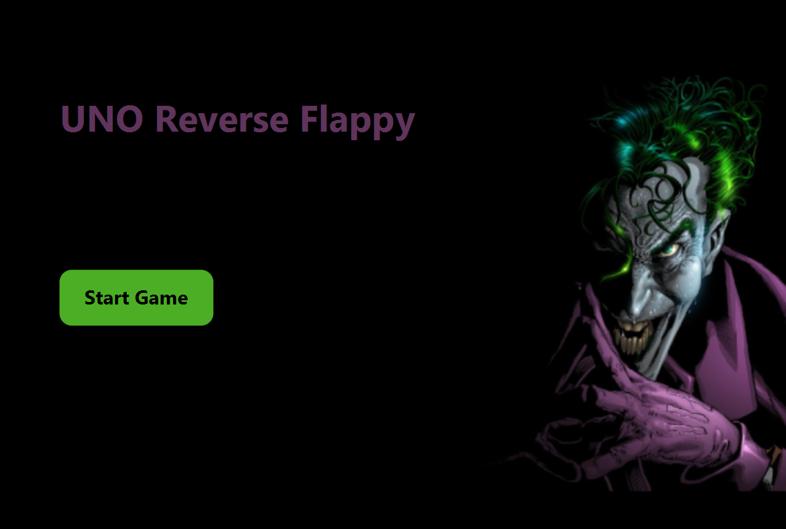
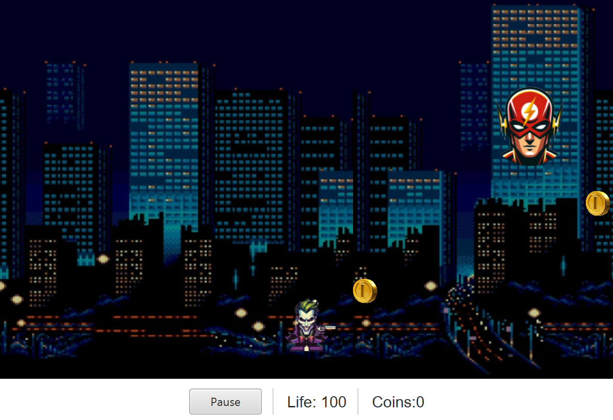

# 🃏 Flappy Joker

This is a side-scrolling action game inspired by Flappy Bird, where you play as the Joker. Your mission? Collect coins, avoid or shoot heroes, and cause chaos, all while flying through Gotham with style.

## 🎮 Game Description

In this game, you are the Joker, flapping through the city to:

- Collect coins 💰
- Avoid or shoot heroes 🦸‍♂️
- Survive as long as possible to rack up your score!

Features include:

- Flappy-style flying mechanic
- Gun with shooting animation 🔫
- Sound effects and background music 🎵
- Game over popup with stats
- Main menu with a stylized home screen

## 🛠️ Requirements

To run the game with music and sound:

- JavaFX
- JLayer 1.0.1 for MP3 support

## ⚙️ Setup Instructions

1. Clone the repository:

   git clone https://github.com/your-username/uno-reverse-flappy.git  
   cd uno-reverse-flappy

2. Add JLayer to Your Project (for IntelliJ IDEA):

   - Go to File → Project Structure  
   - Under Libraries, click + → Java  
   - Select `jl1.0.1.jar` and click Apply  
   - Ensure `SoundPlayer.java` recognizes the JLayer import

3. Run the project through your IDE or preferred build tool.

## ▶️ How to Play

- Press a key or click to jump/fly Joker upward.
- Collect coins to increase your score.
- Use your gun to shoot heroes in your way.
- Avoid hitting obstacles or getting caught by heroes.
- Survive as long as you can!

## 🧱 Built With

- Java
- JavaFX
- JLayer (for sound)

## 📸 Screenshot

## 📄 License

This project is licensed under the MIT License.

---

Enjoy flying through Gotham as the Clown Prince of Crime! 🤡💣🪙
